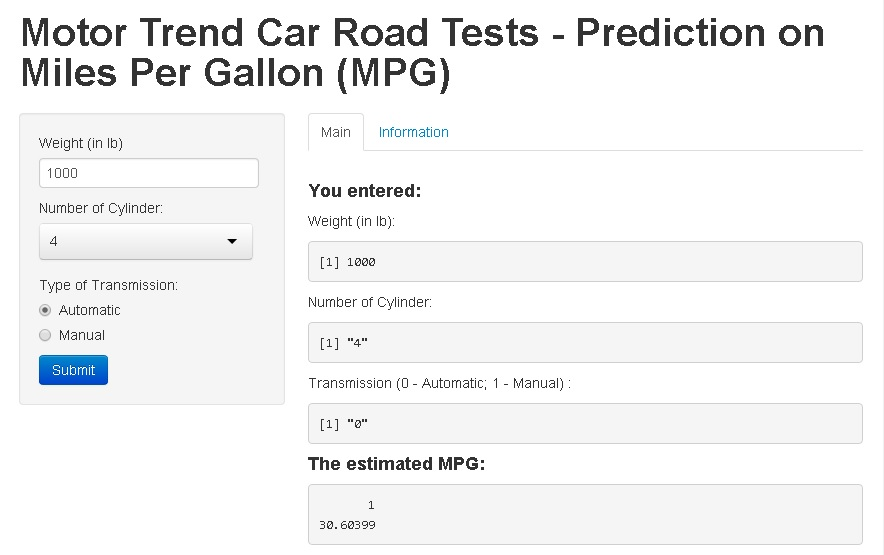

## Background
In this project, by using Shiny, we adopted motor trend car toad tests (mtcars) dataset to create a model for predicting Miles Per Gallon (MPG) usage of a car.

The dataset with 32 observations on 11 variables.

```r
library(datasets)
head(mtcars)
```

```
##                    mpg cyl disp  hp drat    wt  qsec vs am gear carb
## Mazda RX4         21.0   6  160 110 3.90 2.620 16.46  0  1    4    4
## Mazda RX4 Wag     21.0   6  160 110 3.90 2.875 17.02  0  1    4    4
## Datsun 710        22.8   4  108  93 3.85 2.320 18.61  1  1    4    1
## Hornet 4 Drive    21.4   6  258 110 3.08 3.215 19.44  1  0    3    1
## Hornet Sportabout 18.7   8  360 175 3.15 3.440 17.02  0  0    3    2
## Valiant           18.1   6  225 105 2.76 3.460 20.22  1  0    3    1
```

```r
dim(mtcars)
```

```
## [1] 32 11
```

--- .class #id 

## Design of the Shiny Application - Frontend

- We created a web form to let the user input three pieces of information: (i) Weight in Pound, (ii) Number of Cylinder, and (iii)Type of Transmission.
- Once the user pressed the submit button, the data will send to backend.

___



--- .class #id 

## Design of the Shiny Application - Backend

- In backend, we loaded the dataset, converted the categorical variables into factors and prepared the linear model.
- The linear model is shown as follows:

$$mpg \sim wt + cyl + am$$

where $mpg$ is miles per gallon, $wt$ is weight in 1000 lb, $cyl$ is number of cylinder and $am$ is the type of transmission (0 - Automatic, 1 - Manual)

--- .class #id 

## Demostration

Shinyapp.io link: 
https://tobylam.shinyapps.io/devDataProd/

Source code:
https://github.com/2blam/DevDataProd/tree/master/shinyapp

